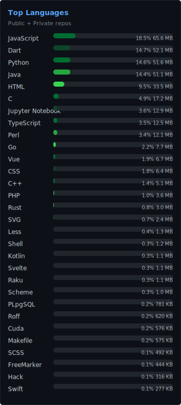

<table>
<tr>
  <td width="50%" align="center">
    
  </td>
  <td width="50%" align="center">
    
  </td>
</tr>
</table>

<table>
<tr>
  <td width="33%" valign="top">
    
  </td>
  <td width="67%" valign="top">

### 👨‍💻 About Me

> *"The essence of learning is imitation, and the essence of creation is insight."*
> *"Laziness is the core driving force for scientific and technological progress."*

I'm a developer who believes **if you do something twice, you should automate it the third time**. I write code that saves people from doing the same thing over and over — whether that's CI/CD pipelines, Docker image builders, web scrapers, or AI-powered agents.

🧠 **What makes me different**: I don't just write code — I think in systems. Network architecture, security boundaries, data pipelines, deployment workflows — I connect the dots others miss.

🔧 **What I ship**: Production-grade tools, not prototypes. My repos are built to be used by real teams with real deadlines.

  </td>
</tr>
</table>

### 🛠️ Tech Arsenal

<table>
  <tr><th width="90">Category</th><th width="85">细分</th><th>Stack</th></tr>

  <!-- Languages -->
  <tr><td rowspan="1"><b>Languages</b></td>
      <td>—</td>
      <td>      </td></tr>

  <!-- Backend -->
  <tr><td rowspan="4"><b>Backend</b></td>
      <td>Python</td>
      <td>  </td></tr>
  <tr><td>Java</td>
      <td>  </td></tr>
  <tr><td>PHP</td>
      <td> </td></tr>
  <tr><td>Go</td>
      <td></td></tr>

  <!-- Frontend -->
  <tr><td rowspan="3"><b>Frontend</b></td>
      <td>Frameworks</td>
      <td>   </td></tr>
  <tr><td>3D / Graphics</td>
      <td> </td></tr>
  <tr><td>Build</td>
      <td></td></tr>

  <!-- Mobile & Mini Programs -->
  <tr><td rowspan="3"><b>Mobile &amp; Mini Programs</b></td>
      <td>Cross-platform</td>
      <td> </td></tr>
  <tr><td>Native</td>
      <td>-3DDC84?logo=android) </td></tr>
  <tr><td>Mini Programs</td>
      <td></td></tr>

  <!-- Data & Big Data -->
  <tr><td rowspan="5"><b>Data &amp; Big Data</b></td>
      <td>Databases</td>
      <td>    </td></tr>
  <tr><td>Search</td>
      <td></td></tr>
  <tr><td>Storage</td>
      <td> </td></tr>
  <tr><td>Streaming</td>
      <td> </td></tr>
  <tr><td>Processing</td>
      <td> </td></tr>

  <!-- DevOps & Infra -->
  <tr><td rowspan="5"><b>DevOps &amp; Infra</b></td>
      <td>Container</td>
      <td></td></tr>
  <tr><td>CI/CD</td>
      <td> </td></tr>
  <tr><td>Web Server</td>
      <td></td></tr>
  <tr><td>OS</td>
      <td></td></tr>
  <tr><td>Panel</td>
      <td> </td></tr>

  <!-- Task Scheduling -->
  <tr><td rowspan="1"><b>Task Scheduling</b></td>
      <td>—</td>
      <td> </td></tr>

  <!-- Security -->
  <tr><td rowspan="3"><b>Security</b></td>
      <td>WAF</td>
      <td>  </td></tr>
  <tr><td>Penetration</td>
      <td> </td></tr>
  <tr><td>Research</td>
      <td></td></tr>

  <!-- AI / LLM -->
  <tr><td rowspan="3"><b>AI / LLM</b></td>
      <td>Frameworks</td>
      <td>  </td></tr>
  <tr><td>Design</td>
      <td> </td></tr>
  <tr><td>Tools</td>
      <td></td></tr>
</table>

---

### 🔥 Why Work With Me

<table>
  <tr>
    <td width="33%" align="center">
      <h4>🧑‍💼 Recruiters</h4>
      Full-stack with real production experience. I build systems end-to-end — from infrastructure to UI to deployment.
    </td>
    <td width="33%" align="center">
      <h4>🤝 Outsourcing</h4>
      Fast delivery, clean code, no hand-holding needed. Django · Scraping · DevOps · Apps.
    </td>
    <td width="33%" align="center">
      <h4>👨‍💻 Developers</h4>
      Open-source tools you'll actually use. Star what helps, fork what inspires — I build for builders.
    </td>
  </tr>
</table>

---

### 📬 Let's Connect

<table>
  <tr>
    <td width="220">
      <table>
        <tr><td>💬 <b>WeChat</b></td><td><code>Sadam190</code></td></tr>
        <tr><td>📧 <b>Email</b></td><td><code>haoke98@outlook.com</code></td></tr>
        <tr><td>📝 <b>CSDN</b></td><td><a href="https://blog.csdn.net/weixin_43066097">weixin_43066097</a></td></tr>
        <tr><td>🟢 <b>公众号</b></td><td><b>「IzBasar科技」</b> 技术实战 · 工具推荐 · 行业洞察</td></tr>
      </table>
    </td>
    <td width="200" align="center" style="border-left:1px solid #30363d; padding-left:16px;">
       
      📱 扫码关注
    </td>
  </tr>
</table>

  

---

### 🏆 GitHub Journey

---

### 🔧 Forked & Enhanced

> *Standing on the shoulders of giants — customized and battle-tested.*

| Project | What I Did |
|---------|-------------|
| [**lanproxy**](https://github.com/Haoke98/lanproxy) | 内网穿透代理 — 生产环境适配 & 增强 |
| [**Ingram**](https://github.com/Haoke98/Ingram) | 网络摄像头漏洞扫描 — 规则库扩展 |
| [**HuggingfaceDownloader**](https://github.com/Haoke98/HuggingfaceDownloader) | 模型下载工具 — 国内网络优化 |
| [**lanproxy-go-client**](https://github.com/Haoke98/lanproxy-go-client) | Go 客户端实现 |
| [**video2gif**](https://github.com/Haoke98/video2gif) | 视频转 GIF — 批量处理增强 |
| [**nginx-windows**](https://github.com/Haoke98/nginx-windows) | Windows Nginx 适配 |
| [**bawa**](https://github.com/Haoke98/bawa) | 工具适配 & Bug 修复 |

### 🧰 Built From Scratch

> *Real problems, real solutions. Every tool below solves a problem I actually had.*

| Project | Solves |
|---------|--------|
| [**FlowPilot**](https://github.com/Haoke98/FlowPilot) | 🤖 自动化工作流引擎 — 把重复流程变成可编排的 Pipeline |
| [**RAGFlow-pipeline**](https://github.com/Haoke98/RAGFlow-pipeline) | 🧠 RAG 数据处理流水线 — 从文档到向量库一条龙 |
| [**RuoYi-Agent**](https://github.com/Haoke98/RuoYi-Agent) | 🤖 若依框架 AI Agent 集成 — 企业后台秒变智能 |
| [**WebAppDockerImageBuilder**](https://github.com/Haoke98/WebAppDockerImageBuilder) | 🐳 Web 应用一键 Docker 化 — 告别手写 Dockerfile |
| [**docker-cli**](https://github.com/Haoke98/docker-cli) | 🐳 Docker 命令行增强 — 常用操作一行搞定 |
| [**super-http-catcher**](https://github.com/Haoke98/super-http-catcher) | 📡 HTTP 抓包 & 重放 — 调试 API 的瑞士军刀 |
| [**ElasticsearchHelper**](https://github.com/Haoke98/ElasticsearchHelper) | 🔍 ES 运维助手 — 索引管理、数据迁移、健康检查 |
| [**PgDiff**](https://github.com/Haoke98/PgDiff) | 🗄️ PostgreSQL 差异比对 — Schema & Data Diff 一目了然 |
| [**SuperSniffer**](https://github.com/Haoke98/SuperSniffer) | 📡 网络嗅探分析 — 流量可视化 |
| [**DeepFC**](https://github.com/Haoke98/DeepFC) | 🧠 深度学习文件分类器 |
| [**auto-git**](https://github.com/Haoke98/auto-git) | 🔄 Git 自动化 — 批量操作仓库 |
| [**gitlab-pipline**](https://github.com/Haoke98/gitlab-pipline) | ⚙️ GitLab CI/CD 流水线增强 |
| [**LabelPrintHelper**](https://github.com/Haoke98/LabelPrintHelper) | 🏷️ 标签打印助手 |

### 🧩 Reusable Building Blocks

| Project | Type |
|---------|------|
| [**DjangoAsyncAdmin**](https://github.com/Haoke98/DjangoAsyncAdmin) | Django 异步 Admin 面板 |
| [**django-celery-stack**](https://github.com/Haoke98/django-celery-stack) | Django + Celery 任务栈 |
| [**django-go-view**](https://github.com/Haoke98/django-go-view) | Django + Go 混合视图 |
| [**iCloudDjango**](https://github.com/Haoke98/iCloudDjango) | iCloud 风格 Django 后台 |
| [**UniversalToolKit**](https://github.com/Haoke98/UniversalToolKit) | 通用 Python 工具包 |
| [**FDEasyChainApi-PythonSDK**](https://github.com/Haoke98/FDEasyChainApi-PythonSDK) | 丰盾易链 API SDK |
| [**saer-openapi-sdk**](https://github.com/Haoke98/saer-openapi-sdk) | SAER OpenAPI SDK |
| [**OpenAPI-SDK**](https://github.com/Haoke98/OpenAPI-SDK) | 通用 OpenAPI SDK |

### 💻 Full Applications

| Project | What |
|---------|------|
| [**AllKeeper**](https://github.com/Haoke98/AllKeeper) | 全能信息管理平台 — Web + 桌面 |
| [**PassKeyVault**](https://github.com/Haoke98/PassKeyVault) | 密码 & 密钥管理保险库 |
| [**iCloudDesktop**](https://github.com/Haoke98/iCloudDesktop) | iCloud 风格桌面客户端 |
| [**CTFD-3DS**](https://github.com/Haoke98/CTFD-3DS) | CTF 竞赛 3D 展示系统 |
| [**TTMS-beego**](https://github.com/Haoke98/TTMS-beego) | 教务管理系统 (Go/Beego) |
| [**BeanMusic**](https://github.com/Haoke98/BeanMusic) | 豆瓣风格音乐平台 |

### 🧪 Research & Security

| Project | Focus |
|---------|-------|
| [**FrameDiffusion**](https://github.com/Haoke98/FrameDiffusion) | 视频帧扩散模型实验 |
| [**Turing-Utopia-Experiment**](https://github.com/Haoke98/Turing-Utopia-Experiment) | 图灵乌托邦实验 |
| [**CVE**](https://github.com/Haoke98/CVE) | 个人 CVE 漏洞知识库 |

---

💡 Orgs I follow

<ul>
  <li><a href="https://github.com/spotify">Spotify</a> — 流媒体技术标杆</li>
  <li><a href="https://github.com/CompVis">CompVis</a> — 计算机视觉前沿</li>
</ul>

---

  ⭐ <b>Star what you find useful</b> · 🔗 <b>Fork what inspires you</b> · 📩 <b>Reach out if you want to build together</b>

